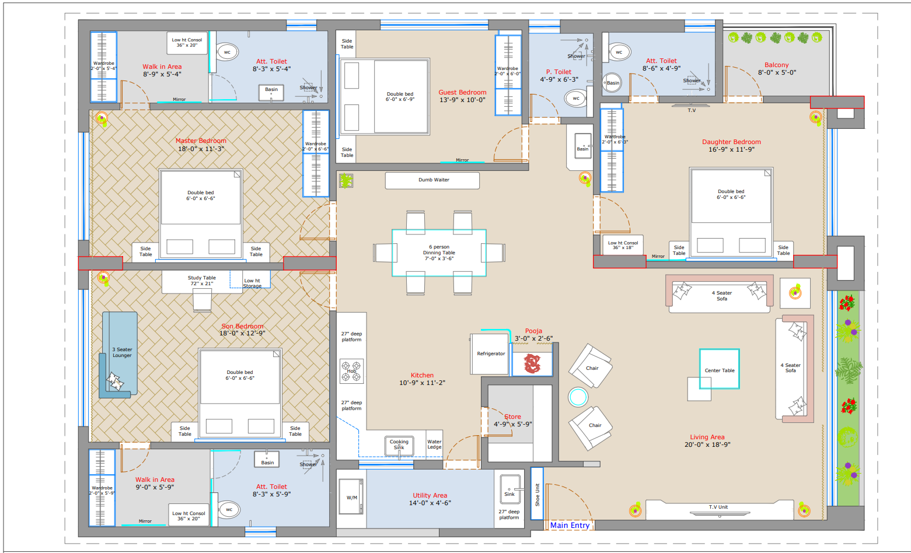
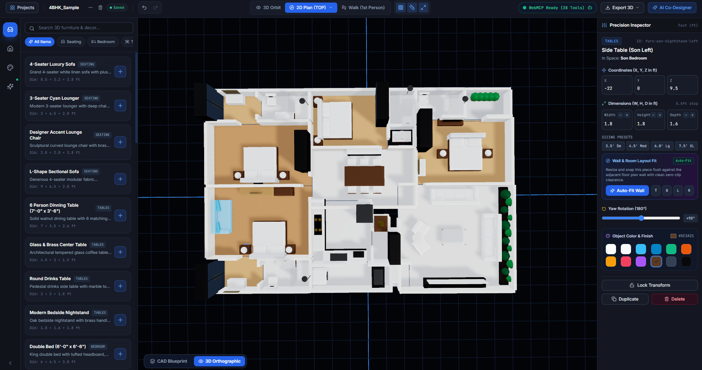
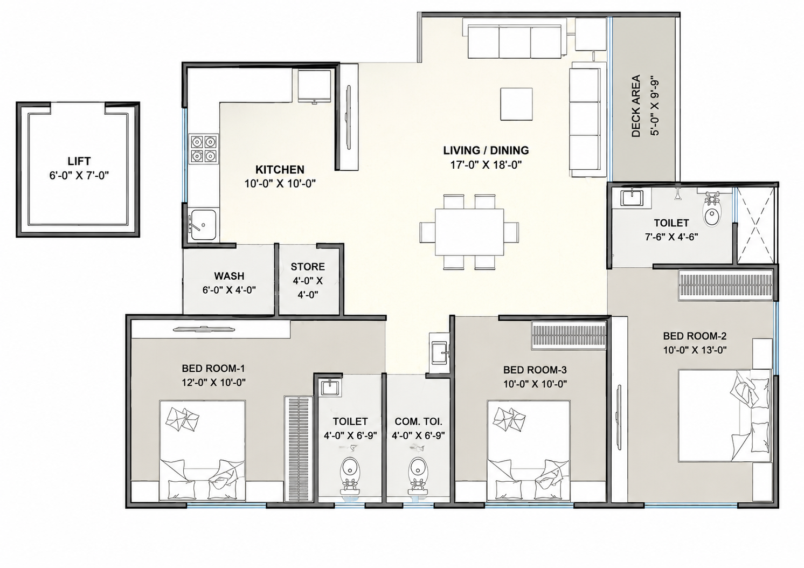
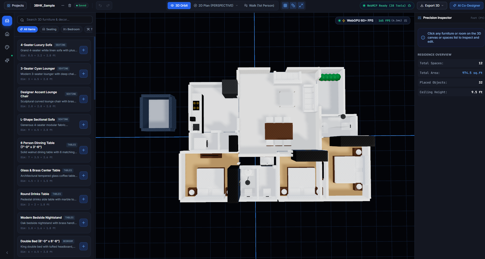

# HouseSpace (HomeSpace.ai) — Collaborative 3D Architectural Studio

> **Design a house with a human or an AI agent, in the same room.**  
> Built for the WebMCP Hackathon (OpenAI).

**HouseSpace** is a browser-based architectural design studio where a human designer and an autonomous AI agent share the exact same canvas, tools, and state. Every action available in the UI — creating rectangular or L-shaped rooms, carving out alcoves, snapping furniture, switching camera modes, calibrating blueprint overlays, or exporting 3D BIM models — is also an executable WebMCP tool an agent can call directly on the live scene graph.

---

## 2D Blueprint → 3D Model Transformation

HouseSpace deterministically transforms real-world 2D architectural blueprints into interactive, fully furnished 3D spaces with dimension-accurate walls, openings, and materials.

| 2D Architectural Blueprint | Generated 3D Interactive Model |
| :---: | :---: |
| **Sample 1: 4BHK Luxury Residence (2,320 sq ft)**<br>*(Source: `Sample_maps/Sample_1.png`)*<br><br> | **4BHK 3D Scene Reconstruction**<br>*(Reconstructed: `Sample_maps/4BHK_Sample_3D.png`)*<br><br> |
| **Sample 2: 3BHK Apartment Layout (975 sq ft)**<br>*(Source: `Sample_maps/Sample_2.png`)*<br><br> | **3BHK 3D Scene Reconstruction**<br>*(Reconstructed: `Sample_maps/3BHK_Sample_3D.png`)*<br><br> |

---

## Why WebMCP?

- **Shared Live State:** The agent calls WebMCP tools on `document.modelContext` that directly mutate the live Three.js scene graph. No polling, no shadow DOM, and zero lag.
- **Strictly Schema-Constrained:** 45 tools with strict parameter validation (stable UUIDs, coordinate vectors, and feet as canonical units).
- **Confirmation Gates:** Irreversible actions (clearing scenes, deleting rooms, BIM export) require in-page human approval modals (`requiresConfirmation: true`).
- **Full Parity:** Agents possess the exact same 3D design surface, precision transforms, and undo/redo history stack (`Ctrl+Z` / `Ctrl+Y`) as human users.

---

## Quick Start

```bash
# Install dependencies
npm install

# Start local development server
npm run dev

# Run all 10 architectural and WebMCP test suites
npm run test:all
```

Open [http://localhost:4173/](http://localhost:4173/) in your browser.

---

## Core Features

- **Multi-Mode Camera System:**
  - **3D Orbit:** Freely rotate, tilt, and inspect the entire residence.
  - **2D CAD Orthographic:** Top-down plan view and directional elevations (North, East, South, West).
  - **First-Person Walk:** Immersive walkthrough mode with WASD controls and collision-aware navigation.
- **Polygonal & L-Shaped Architecture:** Build rectangular rooms, 6- to 8-vertex L-shaped rooms with corner notches (NW, NE, SW, SE), and automatic shared-wall gateway openings.
- **CAD Blueprint Inspection & Calibration:** Inspect pre-loaded benchmark blueprints (Sample 1: 4BHK, Sample 2: 3BHK) directly on the 3D grid, calibrate scale to real-world feet, and toggle view modes (`Combined`, `Geometry Only`, `Blueprint Only`). *(2D Floor Plan upload & automated CAD import coming soon)*.
- **Procedural PBR Furniture & Wall Snapping:** Smart placement with automatic wall clearance snapping (`fit_furniture_to_wall`) and room-wide layout solving.
- **Project Manager:** Browser-local IndexedDB storage supporting multiple projects, templates, quick search (`Ctrl+K`), and instant project duplication.
- **BIM & CAD Export:** Export scenes to **GLB / OBJ** (3D rendering) or **IFC4** (BIM for Revit / Archicad).

---

## WebMCP Tools (46 Tools)

HouseSpace exposes 46 strictly typed tools across 7 functional domains. For complete schemas and parameter definitions, see [WEBMCP_TOOLS.md](WEBMCP_TOOLS.md).

| Category | Count | Example Tools |
| :--- | :---: | :--- |
| **Rooms** | 11 | `create_room`, `add_connected_room`, `set_room_notch`, `fit_room_into_notch`, `add_wall_alcove`, `delete_room` |
| **Structure** | 5 | `add_wall`, `place_door`, `place_window`, `change_ceiling_height` |
| **Objects** | 10 | `add_furniture`, `move_object`, `rotate_object`, `fit_furniture_to_wall`, `auto_fit_room_furniture` |
| **Materials** | 2 | `apply_material`, `change_texture` |
| **Scene / View** | 6 | `switch_view`, `take_screenshot`, `get_scene_state`, `set_grid_snap` |
| **Workflow** | 11 | `undo`, `redo`, `export_model`, `create_project`, `load_sample_project`, `clear_scene` |
| **CAD Synthesis** | 1 | `build_3d_from_cad` |

### Connectivity

1. **Native WebMCP:** Available on `document.modelContext`.
2. **Global Fallback:** `window.housespaceAgent.callTool(name, params)`.
3. **Custom DOM Events:** Dispatch `housespace:agent-call` and listen for `housespace:agent-result`.

---

## Automated Test Suites

Run the complete test suite with `npm run test:all`:

| # | Suite | Focus Area |
| :-: | :--- | :--- |
| **1** | `test_room_creation_fix.ts` | Room creation, auto-snap, gateway cutouts, undo/redo |
| **2** | `test_l_shaped_rooms.ts` | Non-rectangular polygon footprints & corner notches |
| **3** | `test_alcoves_and_alignment.ts` | 8-vertex wall alcoves & outward wings |
| **4** | `test_furniture_dimension_tools.ts` | Furniture resizing & wall clearance snapping |
| **5** | `test_webmcp_audit.ts` | WebMCP protocol, tool registry (45 tools), JSON schema |
| **6** | `test_project_system.ts` | Multi-project IndexedDB persistence & lifecycle |
| **7** | `test_delete_project.ts` | Project deletion safety & confirmation gates |
| **8** | `test_cad_to_3d.ts` | Deterministic 2D blueprint to 3D space generation |
| **9** | `test_floorplan_accuracy.ts` | Dimensional accuracy & constraint solving |
| **10** | `validate_layout.ts` | End-to-end autonomous suite & interior layout validation |

---

## Architecture

- **Frontend:** React 18 + TypeScript + Vite
- **3D Graphics:** Three.js (PBR materials, custom geometry extrusions, shadow maps)
- **State Management:** Zustand (decoupled stores for geometry, UI, projects, history, and agent telemetry)
- **Storage:** Browser IndexedDB via `idb`
- **Agent Interoperability:** W3C WebMCP (`document.modelContext`) + fallback bridge
