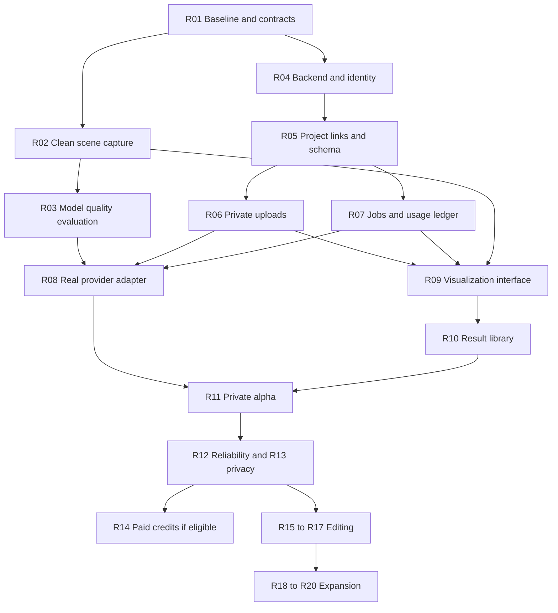

# HomeSpace.ai — feature implementation roadmap

Prepared: 11 September 2026  
Status: Free-stack Photo Design MVP implemented and connected to Supabase; later roadmap stages remain planned.  
Scope: Interior AI-inspired visualization integrated into the existing HomeSpace studio.  
Inputs: [Feature proposal](interior-ai-feature-proposal.md), [provider research](interior-ai-provider-research.md), and current source inspection.  
Tool references: [Current tooling research](implementation-tooling-research.md).

## Implementation milestone - 14 September 2026

The current milestone implements the free tools where they serve the MVP: Fastify and request throttling, Sharp, PostgreSQL/pg-boss, Supabase Auth/private Storage, and existing React/WebMCP workflows. The user approved Supabase during implementation, replacing the earlier decision to defer it. No Docker database, paid host, Redis, payment processor or additional image provider was added.

| Roadmap area | Actual status |
| --- | --- |
| R01 contracts and regression baseline | Shared photo model/service and existing architecture suites verified |
| R02 clean scene capture | Still planned; current source is an uploaded room photo |
| R03 real model quality benchmark | Pending OpenAI key and a deliberate paid quality trial |
| R04 backend and identity | Fastify and Supabase email/password authentication implemented |
| R05 schema and project links | Private photo jobs and account photo library migrated; architectural projects remain local |
| R06 private images | Private buckets, owner policies, server decoding/normalization and thumbnails implemented |
| R07 job processing and usage | Atomic ledger + pg-boss enqueue, safe claim, recovery and global/per-user attempt caps implemented; no payment credits system |
| R08 image provider | Existing OpenAI adapter migrated to durable processing; fake-provider tests pass, real generation untested without key |
| R09-R10 workspace and library | Signed-in upload/settings/history/compare/favorite/download plus existing 13 photo tools implemented |
| R11 verification | Local and live Supabase functional tests; not a real image-quality evaluation |
| R12-R13 public operations | Single-process production runner and access controls available; public hosting, mail setup and automated cleanup still need rollout work |
| R14-R20 expansion | Not part of this MVP tooling milestone |

See [Photo Design MVP setup and limitations](../PHOTO_DESIGN.md) for configuration, commands, cost boundaries, verification and remaining launch requirements. This status table supersedes speculative provider/hosting choices below; the rest remains a future implementation plan.

## 1. What we will deliver

The first release lets a signed-in user upload a room photo or capture a HomeSpace room, select a style, generate an AI image, compare it with the source, and save/download the result. Generation continues when the user closes the tab. Local scene editing remains usable without signing in.

The image is a visual concept. It never silently changes room dimensions, openings, furniture or the source scene. Editable scene changes are a later feature with their own validation and undo behavior.

Suggested delivery sequence:

| Release | User-visible outcome | Included task IDs |
| --- | --- | --- |
| Quality prototype | Evidence that a model produces useful room concepts | R01–R03 |
| Private alpha | Photo + scene visualization, project history, internal credits | R04–R11 |
| Public beta | Reliable operations, deletion, usage limits, optional paid credits | R12–R14 |
| Editing release | Staging, brush edits, reference styles and better exports | R15–R17 |
| Spatial/presentation expansion | Reviewed scene changes, agent tools, sharing, video/worlds | R18–R20 |

Working assumptions: one experienced full-stack developer, existing React/TypeScript/Three.js frontend, hosted inference, one output per job initially, roughly eight tested styles, and private alpha before selling subscriptions. These choices can change after the prototype, but the developer should not need to invent them while implementing a task.

## 2. Tools: what is free, what costs money

Recommended starting stack: retain the frontend; add a Node/TypeScript backend, Supabase for identity/database/private images, PostgreSQL-backed background jobs, and one hosted image provider. Keep the present frontend host if it supports the new route. No frontend framework migration is required.

| Tool | Use | Free/paid classification | When needed |
| --- | --- | --- | --- |
| Existing React, TypeScript, Vite, Three.js | App and scene rendering | Existing open-source dependencies; no model charges for local scene rendering | Throughout |
| Fastify | Node HTTP routes | Open-source library; hosting costs separately | R04 |
| Sharp | Validate/normalize images and create thumbnails | Open-source library; CPU/memory costs separately | R06 |
| Supabase | Authentication, PostgreSQL and private object storage | Hosted Free tier for development; paid plans/usage for expanded operation | R04 onward |
| pg-boss | Durable Node jobs backed by PostgreSQL | Open-source library; database/worker compute costs separately | R07 |
| Railway | Host Node web process and persistent worker | Budget as paid hosting; any trial/credit is temporary | R11 onward |
| Current frontend host | Serve the Vite build | Depends on existing account and plan; inspect before changing | R11 |
| Cloudflare Pages, optional alternative | Static frontend hosting | Free tier with limits; backend worker hosting is a separate concern | Only if a host is needed |
| BFL image editing | Initial hosted-provider candidate | Paid inference; benchmark before choosing the production model | R03, R08 |
| Existing Playwright and TypeScript test tooling | Browser and logic verification | Local tests have no model fee; CI usage may be metered | Throughout |
| Payment processor, e.g. Stripe if eligible | Sell credits later | Test mode for integration; live payments incur fees and require an eligible account | R14 only |
| Razorpay, payment alternative | Candidate for an Indian operating business | Paid transaction processing; eligibility and activation must be confirmed | R14 if selected |
| Custom SMTP sender, if using email sign-in | Deliver authentication and reset emails | Separate account; free allowance or paid usage depends on provider | Before public email sign-in |
| Local PostgreSQL + fake image provider | Development without inference charges | Software can run locally; fake output is a fixture, not real AI | R04–R10 |

Primary documentation: [Fastify](https://fastify.dev/), [Sharp](https://sharp.pixelplumbing.com/), [Supabase pricing](https://supabase.com/pricing), [pg-boss](https://github.com/timgit/pg-boss), [Railway pricing](https://railway.com/pricing), [Cloudflare Pages limits](https://developers.cloudflare.com/pages/platform/limits/), [BFL pricing](https://docs.bfl.ai/quick_start/pricing), [Stripe availability](https://stripe.com/global).

These are planning selections, not installed integrations. Do not assume a free tier covers production backups, uptime, email delivery, storage growth or traffic. Supabase and Railway are separate bills. Paid inference is separate from both. A second image provider is an evaluation alternative, not an additional mandatory dependency. The earlier provider note contains model identifiers; revalidate account access and current model documentation before implementing them.

Supabase's default email sender is intended for testing; configure a custom sender before public email authentication. Select that vendor during R04 and record its current allowance and domain-verification requirements. Razorpay is an alternative to evaluate for an Indian business, with live transaction fees. [Supabase SMTP documentation](https://supabase.com/docs/guides/auth/auth-smtp), [Razorpay pricing](https://razorpay.com/pricing/).

For a zero-inference-cost development path, use local PostgreSQL and deterministic fixture outputs, then enable real generation for a bounded evaluation. Self-hosted model weights are another research path, but require compatible licensing, GPU capacity and maintenance; open-source software does not make GPU operation free.

## 3. Source starting points and proposed layout

Verified current starting points:

- [App.tsx](../src/App.tsx) selects landing, dashboard, pricing and studio views.
- [uiStore.ts](../src/state/uiStore.ts) maps paths to these views; add visualization routing here or replace that routing deliberately.
- [project.ts](../src/types/project.ts) has metadata and scene data, with no render library relationship.
- [projectStore.ts](../src/state/projectStore.ts) and [indexedDBStorage.ts](../src/storage/indexedDBStorage.ts) provide local project persistence.
- [StudioCanvas.tsx](../src/canvas/StudioCanvas.tsx) owns rendering and cameras.
- [viewTools.ts](../src/webmcp/tools/viewTools.ts) currently captures a canvas but returns metadata only. Its HD/4K label does not resize the output.
- [historyStore.ts](../src/state/historyStore.ts) provides undo/redo foundations for later scene proposals.

Proposed new files and folders, to be created during implementation:

```text
shared/renderContracts.ts          Request/result types without React imports
src/rendering/captureView.ts       Capture implementation owned by the renderer
src/features/visualize/            Upload, options, progress, comparison, history
src/state/renderStore.ts           Client job/result subscriptions
server/app.ts                     HTTP app and authentication wiring
server/worker.ts                  Durable worker entry point
server/modules/assets/           Upload validation and private asset access
server/modules/generation/       Job orchestration and provider adapters
server/modules/usage/            Reservation, settlement and release
server/modules/projects/         Authenticated links to local projects
server/db/migrations/            Versioned SQL, ownership policies, indexes
tests/rendering/                  Capture and workflow tests
tests/server/                     Database, authorization and recovery tests
tests/e2e/                        User journeys using a fake provider
scripts/evaluate-renders.ts       Explicit paid evaluation runner
```

Follow existing subscription conventions; do not introduce another global state framework just for this feature. Keep large images outside project JSON. Application server code must have a separate build target and must not become reachable from the Vite import graph.

## 4. Dependency map



R04–R07 can proceed with a fake provider while R03 is being evaluated. Do not enable public real generation until R03 passes and R11–R13 acceptance checks are complete. Payment work is optional for a free, invitation-only alpha; enforce internal quotas from the first real integration.

## 5. Implementation tasks

Each task should become a small implementation issue or pull request. Its acceptance criteria are the completion test; checking a box without evidence does not finish it. Effort ranges are developer days and exclude external account approval delays.

### R01 — Establish baseline and freeze the first-release contract

Dependencies: none. Effort: 0.5–1 day. Tools: existing Git/npm/test tooling, no paid tools.

- [ ] Record current branch, working-tree changes, build outcome and full existing test outcome. Preserve unrelated edits.
- [ ] Run `npm run build` and `npm run test:all`; document pre-existing failures separately.
- [ ] Define `photo_redesign` and `scene_visualization` as the only enabled initial modes, one result per job, default draft resolution and eight style IDs.
- [ ] Define `CaptureArtifact`, `RenderRequest`, `RenderJob`, `RenderResult` and public error codes in `shared/renderContracts.ts`.
- [ ] Establish server configuration for maximum upload bytes/pixels, per-user active jobs, daily spend ceiling, and generation enable/disable flag.

Acceptance: a developer can identify all requested inputs and supported job states without reading provider code; baseline evidence is attached. No actual image generation is needed.

### R02 — Make clean scene capture reliable

Dependencies: R01. Effort: 2–3 days. Tools: existing Three.js and browser image encoding, no inference cost.

- [ ] Add `captureView({ width, height, camera, clean: true })` at the renderer-owned interface; return a Blob, dimensions, camera settings and source revision/hash.
- [ ] Capture a consistent scene snapshot after assets and the requested camera frame are ready. Cover the renderer's asynchronous path.
- [ ] Exclude grid, handles, selection highlights, labels and blueprint overlays. Decide how cutaway walls affect interior capture; preview exactly what will be sent.
- [ ] Restore viewport size, visibility and camera state even when capture fails. Avoid adding capture-only changes to undo history.
- [ ] Store a draft capture before navigating out of the studio, because changing views can unmount its canvas.
- [ ] Reuse capture in the screenshot tool, preserving its existing response compatibility and adding an asset reference when appropriate.

Acceptance: output dimensions match the request, no helper graphics appear, an immediate camera change is reflected, and editor state is unchanged after success and forced failure. Verify on at least one small room and one multi-room scene.

### R03 — Prove model quality before committing to a provider

Dependencies: R02 for scene cases. Effort: 2–4 days. Tools: BFL or another verified hosted image editor; paid calls within a chosen evaluation budget.

- [ ] Prepare 30–50 rights-cleared source cases including photos, empty rooms and R02 captures; reserve a holdout subset for final assessment.
- [ ] Select two currently accessible candidate models and record their exact identifiers, pricing page, supported resolutions, retention terms and required credentials.
- [ ] Implement an explicit evaluation script that estimates maximum spend, respects a local run budget, saves outputs privately and records model/settings/time/cost.
- [ ] Run comparable briefs and up to two attempts per case. Have reviewers score architecture retention, plausibility, style adherence and overall usefulness.
- [ ] Save an evaluation summary and choose one production candidate. Record why the other is deferred.

Proposed gate: at least 80% of evaluated cases yield a useful concept within two attempts. For any mode marketed as conservative staging, fewer than 5% of outputs may introduce major changes to visible architecture. These are targets, not measured results; evaluate staging separately. A failed staging gate does not prevent launching general concept visualization with accurate wording.

Acceptance: quality and cost evidence supports a provider choice. If no model passes, investigate depth/edge guidance or conventional rendering before building claims around unproven output quality.

### R04 — Backend skeleton and sign-in

Dependencies: R01. Effort: 1–2 days. Tools: Fastify; Supabase Auth/Postgres, hosted Free tier or local setup.

- [ ] Create a separate Node/TypeScript server build, environment validation, `/health` and `/ready` routes.
- [ ] Configure a development Supabase project, sign-in method and exact allowed redirect URLs. Start with one sign-in method.
- [ ] For email authentication, select/configure a custom SMTP sender and verify the sending domain before public use. For OAuth, configure the selected identity provider's consent screen and redirects instead.
- [ ] Implement server token verification and derive user identity from the verified session, never request body fields.
- [ ] Add a frontend session module and require sign-in when using cloud visualization. Local scene editing still works signed out.
- [ ] Create `.env.example` with placeholders. Only the publishable auth configuration and backend base URL belong in the client; database, privileged storage and inference secrets stay server-side.

Acceptance: signed-out generation requests fail; expired sessions recover cleanly; the build contains no server secrets. Health does not expose credentials or stack traces.

### R05 — Cloud project links and render schema

Dependencies: R04. Effort: 1–2 days. Tools: PostgreSQL migrations and Supabase.

- [ ] Add the records and constraints in Section 6, with ownership policies for every user-accessible table.
- [ ] Create an authenticated remote project link on first visualization use. Support photo-only projects without scene geometry.
- [ ] Add optional local metadata pointing to the remote project. Migrate old projects without rewriting scene coordinates or requiring a reset.
- [ ] Store scene revision and camera provenance for captured inputs. Keep same-browser source snapshots locally for alpha; full cloud scene synchronization is outside this release.
- [ ] Define duplication behavior: a duplicate local project gets a new remote link and no copied render history initially.

Acceptance: an existing IndexedDB project opens after migration; two users with the same local project ID remain isolated; a photo-only project works. A result without an available local snapshot still exposes its original source image.

### R06 — Private image uploads and normalization

Dependencies: R05. Effort: 1–2 days. Tools: private Supabase Storage, Sharp.

- [ ] Add authenticated upload authorization and completion routes. Upload into a quarantine prefix; the server assigns the object key.
- [ ] Start with JPEG, PNG and WebP; proposed limits are 15 MB compressed and 40 megapixels decoded, configurable after device testing.
- [ ] Decode and verify real bytes, normalize orientation, remove unnecessary metadata, enforce pixel limits and produce the provider input plus thumbnail.
- [ ] Mark an asset ready only after normalization. Never submit a client-declared object path directly to the model.
- [ ] Use expiring access URLs and clean abandoned uploads. For provider fetches, scope URLs to a single input and ensure their lifetime covers submission/fetch delay.

Acceptance: fake MIME types, oversized/decompression-heavy images and another user's asset are rejected. Phone image orientation is correct. Source assets are private and uploads can be retried without duplicate ready records.

### R07 — Durable jobs and internal usage credits

Dependencies: R05. Effort: 3–4 days. Tools: pg-boss/PostgreSQL and a fake provider; no real inference needed.

- [ ] Implement `submit`, `get`, `listForProject` and `cancel` on the Generation module.
- [ ] In one transaction, validate/reserve available credits and create the job plus outbox row. Require a unique owner/idempotency key and a request hash.
- [ ] Dispatch outbox rows into pg-boss. Make repeated dispatch harmless using the job ID and a database claim; queue delivery alone does not guarantee exactly-once provider calls.
- [ ] Record provider submission intent before calling externally. Persist its request ID immediately after acknowledgment.
- [ ] Implement the lifecycle and ambiguous-outcome policy in Section 7, including leases and bounded recovery.
- [ ] Settle successful output and release failed/cancelled reservations once, with unique ledger operation keys. Grant an initial internal allowance through an audited admin action.

Acceptance: duplicate submits create one logical job/reservation; concurrent submissions cannot overspend; worker restart is recoverable; invalid state transitions fail. Simulate crashes before submission, after provider acceptance, after asset save and before settlement.

### R08 — Integrate the selected image provider

Dependencies: R03, R06, R07. Effort: 1–2 days. Tools: selected paid model, server-side credentials.

- [ ] Implement a provider adapter inside Generation, with a capability description for modes, references, masks and sizes. Maintain the fake adapter for tests.
- [ ] Build versioned server-owned style templates. Keep user instructions as an input field and validate length; do not let users choose arbitrary provider parameters or billing multipliers.
- [ ] Normalize provider response/status/error handling and persist request identifiers. Use documented callbacks or polling support.
- [ ] Copy completed output into private storage, validate its decoded format/size, and generate a thumbnail before publishing success.
- [ ] Record actual vendor usage/cost separately from user credits. Add a server kill switch that stops new paid submissions without stopping local editing.

Acceptance: one bounded paid smoke run completes for a photo and a scene capture. Saved results survive expiry of provider output URLs. Rate-limit, moderation and timeout errors map to meaningful application states.

### R09 — Build the visualization workflow

Dependencies: R02, R06, R07; can use a fake provider before R08. Effort: 2–3 days. Tools: existing React/CSS/icons, no new paid UI tool.

- [ ] Add a `/visualize` route and studio action. Preserve back/forward navigation, page titles and source-project context.
- [ ] Build source preview, room type, style selection, optional instruction and one-output cost summary.
- [ ] Show uploading, queued, generating, saving, ready and actionable failure states. Use measured wait guidance, not fabricated percentages.
- [ ] Persist job identifiers remotely and recover the latest state after refresh/sign-in. Poll with backoff and stop polling terminal jobs.
- [ ] Distinguish “Retry” as a new request after confirmed failure from reconnecting to an existing running job.
- [ ] Add mobile layouts, visible focus, labeled controls and accessible status announcements.

Acceptance: both entry paths reach a result; refresh mid-generation resumes; a double click cannot charge twice; switching projects cannot display another project's draft. Existing studio navigation still works.

### R10 — Comparison, saved results and downloads

Dependencies: R09. Effort: 1–2 days. Tools: existing frontend and private storage.

- [ ] Create a paginated project result library with thumbnails, favorite and delete actions.
- [ ] Build source/result slider and side-by-side views with keyboard-operable comparison controls.
- [ ] Show style, creation time and source scene revision. Mark a scene-derived result as older when the current scene hash differs.
- [ ] Download from a fresh authorized URL; do not require a still-valid provider URL.
- [ ] Reopen a local source snapshot as an explicit action, with unsaved-work handling. Show a clear fallback when that snapshot is unavailable on another device.

Acceptance: save/favorite survives reload; downloads open correctly; different aspect ratios compare sensibly; no generated image mutates the scene. Empty, loading and deleted states are usable.

### R11 — Deploy a private alpha

Dependencies: R08–R10. Effort: 1–2 days. Tools: existing/static frontend host, paid Node host, Supabase; provider usage.

- [ ] Provision separate development/production credentials and private buckets; keep test fixtures out of production storage.
- [ ] Deploy a Node web process and persistent worker from the same version. Configure database SSL/connections and verify pg-boss compatibility with the chosen connection mode.
- [ ] Prefer a direct or session-pooled database connection for the persistent worker, with bounded connection pools; verify networking support and avoid assuming transaction pooling retains session state. See the [Supabase connection guide](https://supabase.com/docs/guides/database/connecting-to-postgres).
- [ ] Apply migrations before enabling the feature; configure allowed origins, authentication redirects and frontend route fallback.
- [ ] Restrict real generation to an invitation list, two active jobs per user initially, a small daily allowance and a global spend limit.
- [ ] Verify browser → upload → queue → provider → private result → download on the deployed environment.

Acceptance: five invited users can complete the journey; a worker restart does not lose accepted jobs; the generation kill switch works. Produce a short deployment/runbook document with exact commands actually used.

### R12 — Recovery, performance and operational visibility

Dependencies: R11. Effort: 2–3 days. Tools: host logs/metrics initially; a dedicated paid monitoring product is optional later.

- [ ] Log job ID, state transitions, timing and normalized errors; exclude source images, signed URLs and credentials.
- [ ] Measure queue time, p50/p95 completion time, failure rate, cost per attempt and cost per accepted output.
- [ ] Reconcile expired leases, pending outbox rows, unresolved provider calls and unfinalized results. Alert an operator when intervention is needed.
- [ ] Test rate limits, provider outage, database outage, expiring asset links and load at the configured concurrency limit.
- [ ] Verify database backup/restore and private image recovery expectations for the selected paid/free plans. Document any limitation that prevents public launch.

Acceptance: each failure scenario has a demonstrated recovery path and bounded cost; the operator can identify a stuck job from its ID. Publish measured latency expectations rather than a fixed “instant” promise.

### R13 — Retention and deletion before public access

Dependencies: R11. Effort: 1–2 days. Tools: existing database/worker/storage.

- [ ] Define an initial retention policy for completed results, originals, abandoned uploads and diagnostic metadata. Put it in user-facing copy and server cleanup settings.
- [ ] Implement render, project and account deletion as tombstone-first operations. Stop new jobs and prevent late callbacks from recreating deleted assets.
- [ ] Handle originals referenced by remaining results; use reference checks or delete the whole dependent chain explicitly.
- [ ] Verify provider retention/deletion terms and any available deletion operation. Describe actual behavior without promising unsupported zero retention.
- [ ] Test cross-user access at HTTP, database and storage layers; privileged backend credentials must not bypass application ownership checks.

Acceptance: deleted items cannot be fetched or resurrected; cleanup is retryable; all ownership tests pass; privacy copy matches observed behavior.

### R14 — Sell credits, only after usage is measurable

Dependencies: R12–R13 and an eligible merchant account. Effort: 2–3 days after account setup. Tools: payment processor, paid transaction fees.

- [ ] Verify processor eligibility for the business's actual country/entity. Do not make a Stripe account a critical-path assumption for an India-based business; see the tooling note.
- [ ] If Stripe is unavailable, assess Razorpay account eligibility and the desired domestic/international payment methods before selecting an adapter. [Stripe India availability](https://support.stripe.com/questions/stripe-accounts-are-invite-only-in-india?locale=en-GB), [Razorpay pricing](https://razorpay.com/pricing/).
- [ ] Start with a fixed credit pack; choose its price from measured vendor/hosting cost and desired margin. Subscriptions can follow.
- [ ] Create checkout server-side from an allowlisted product. Never grant credits from the browser's “payment successful” page.
- [ ] Verify webhook signatures and unique event/payment IDs; grant purchased credits once in a transaction.
- [ ] Handle delayed events, refunds/disputes and already-spent credits through an explicit ledger policy; retain auditable history.
- [ ] Update the existing free-preview pricing copy to explain AI generation charges accurately.

Acceptance: test purchase, duplicate webhook, delayed payment and refund cases settle correctly. Run one small live transaction only after merchant activation and reconcile it. If onboarding is unavailable, keep the invitation alpha rather than presenting a broken checkout.

### R15 — Empty-room staging and reference styles

Dependencies: R12–R13. Effort: 2–4 days. Tools: same provider if its capabilities pass evaluation; additional paid inference.

- [ ] Enable a dedicated staging mode with constraints for room envelope, openings and viewpoint.
- [ ] Add an optional second reference asset only if the provider supports it; price additional input usage in the quote.
- [ ] Label photo roles explicitly so room geometry comes from the source and style cues come from the reference.
- [ ] Extend the evaluation set with empty rooms, unusual windows, mirrors and contrasting style references. Reuse R03's separate staging gate.

Acceptance: staging meets its geometry-retention target; unavailable reference support is hidden; source/reference uploads remain private. Reject claims of exact product reproduction unless independently established.

### R16 — Brush edits, wall finishes and furniture replacement

Dependencies: R15 and a tested mask/edit capability. Effort: 3–5 days. Tools: Canvas drawing, Sharp compositing where needed, paid inference.

- [ ] Add mask painting/erasing with zoom, brush-size control and undo for mask strokes.
- [ ] Store mask dimensions plus the display-to-source transform; test scaling, cropping and orientation.
- [ ] Create a new result with parent result and mask references. Treat each edit as a quoted operation.
- [ ] Offer focused presets such as change wall color, replace sofa and remove an artifact, backed by the same edit interface.
- [ ] If strict outside-region preservation is promised, composite with the original and test edge blending/occlusion. A model mask alone may not enforce it.

Acceptance: the edited area aligns at full resolution; version history works; preserved pixels remain unchanged when that guarantee is enabled; seams and unintended furniture changes are reviewed.

### R17 — Higher-resolution export and additional inputs

Dependencies: R16. Effort: 2–4 days. Tools: provider high-resolution/upscale capability if available; paid inference when used.

- [ ] Add a separate export-quality quote; do not charge again for downloading an already-generated file.
- [ ] Treat AI upscale as its own job/result variant; a Sharp resize is only resampling and must not be marketed as recovered detail.
- [ ] Add sketch/screenshot upload presets and outdoor mode only after dedicated evaluations; no native SketchUp file parsing is implied.
- [ ] Measure actual output dimensions, detail quality and artifact changes; update estimates using real usage.

Acceptance: exports have the advertised dimensions, output lineage is retained and repeated downloads do not create paid jobs. New modes have independent evidence before exposure.

### R18 — Reviewed changes to the editable scene

Dependencies: stable rendering and editing. Effort: separate 5–10 day feasibility spike, then estimate delivery. Tools: existing geometry/catalog/undo modules; a structured-output model may add paid usage if selected.

- [ ] Start with existing catalog furniture and material IDs. Generate a typed proposal describing allowed changes to a known scene revision.
- [ ] Validate IDs, dimensions, collisions, room containment and circulation using existing geometry logic. Treat image-derived dimensions as unknown.
- [ ] Show a change preview and validation results. Apply only after user acceptance as one undoable transaction.
- [ ] Reject stale proposals if the source scene changed; preserve locked objects and architecture.

Acceptance: unsupported items are reported, invalid placement is blocked, accepted changes are reversible and measured scene data stays authoritative. Arbitrary photo-to-accurate-3D reconstruction remains separate research.

### R19 — Agent parity and client sharing

Dependencies: R12–R13; R18 for scene changes. Effort: 2–4 days. Tools: existing WebMCP bridge and backend, storage/traffic costs.

- [ ] Expose submit/status/list through the same Generation interface; enforce the same identity, quotas and cost visibility for agent calls.
- [ ] Add expiring/revocable project-result share links with narrowly scoped read access. Do not expose raw bucket paths or all project data.
- [ ] Make optional presentation sheets from selected source/result pairs with source revision and AI concept labels.

Acceptance: agents cannot bypass UI spending rules; revoked links stop working; sharing one result does not reveal other projects. Agent scene changes use R18 validation and existing confirmation conventions.

### R20 — Video and immersive concepts

Dependencies: demonstrated demand and stable image economics. Effort: separate evaluation before a delivery estimate. Tools: paid image-to-video/world provider; verify current access/pricing at that time.

- [ ] Decide whether the outcome is a short video or an explorable generated environment; create separate job types and cost quotes.
- [ ] Evaluate temporal flicker, invented architecture, startup time, mobile performance and file sizes.
- [ ] Store outputs privately, provide poster images and cancel/retry behavior, and reuse retention/access controls.
- [ ] Keep the existing dimensioned Three.js walkthrough available; generated worlds are concept previews, not measured reconstructions.

Acceptance: agreed quality/cost gates pass for the chosen medium. Do not promise video or world generation in a launch plan until a provider and benchmark are verified.

## 6. Data and HTTP contracts to implement

Proposed records:

| Record | Minimum data and constraints |
| --- | --- |
| `project_links` | UUID, owner ID, local project ID, name, deletion marker; unique owner/local ID |
| `assets` | Owner/project, immutable object key, kind, readiness, MIME, dimensions, checksum, bytes, deletion marker |
| `render_jobs` | Owner/project, input asset, mode/style/prompt versions, source revision/camera, status, request hash, timestamps, reserved units; unique owner/idempotency key |
| `provider_attempts` | Job, attempt index, submission intent, provider request ID, status, usage/cost; unique job/attempt |
| `render_results` | Job/output index, output asset, source asset, optional parent/mask, favorite; unique job/output index |
| `credit_accounts` | Owner, available/reserved totals, version; row locked during balance transitions |
| `credit_entries` | Owner/job or payment ID, reserve/settle/release/grant/reversal, units, immutable operation key |
| `job_outbox` | Job ID, event kind, dispatch status; created in the job transaction |

Use foreign keys and ownership checks for every referenced asset/project, not just the top-level request. A unique key with a changed request hash returns a conflict instead of reusing an unrelated generation. Store money in integer minor units or precise decimals with currency; application credits are a separate integer quantity.

Proposed HTTP routes; all are new implementation work:

| Method/path | Request | Result |
| --- | --- | --- |
| `POST /api/projects/link` | Local project ID/name | Authenticated remote project ID |
| `POST /api/assets/uploads` | Project ID, proposed type/size | Upload ID and scoped upload permission |
| `POST /api/assets/:id/complete` | Upload completion | Validating/ready status |
| `GET /api/assets/:id` | Asset ID | Owned metadata and fresh download permission |
| `POST /api/renders/quote` | Mode, ready input asset, quality | Server quote/version, credit cost and expiry |
| `POST /api/renders` | Quote, source/style/instruction, idempotency key | `202` and job ID/status |
| `GET /api/renders/:id` | Job ID | Public status, result reference or safe error |
| `GET /api/projects/:id/renders` | Cursor | Paginated results and pending jobs |
| `POST /api/renders/:id/cancel` | Job ID | Actual cancellation state |
| `PATCH /api/results/:id` | Favorite state | Updated result |
| `DELETE /api/results/:id` | Result ID | Tombstoned state; asynchronous cleanup |
| `GET /api/usage` | Session | Available and reserved credits |

The server revalidates a quote at submission; a client cannot lower its own price. Upload bytes travel through scoped storage access rather than large JSON bodies. Project/account deletion and payment webhook routes are added in R13/R14 with their own tests.

## 7. Recovery rules that must be implemented explicitly

Internal states: `queued → submitting → running → saving → succeeded`. Alternatives: `reconciling`, `failed`, `cancelled`. The UI may map these to simpler wording.

| Event | Required behavior |
| --- | --- |
| Same request submitted twice | Return original logical job; no second reservation |
| Worker dies before paid submission | Reclaim safely after lease expiry |
| Worker dies after submission but before storing request ID | Enter reconciliation; do not blindly submit again |
| Provider supports idempotent submission/recovery | Reuse its documented token or request identifier |
| Provider cannot resolve an ambiguous outcome | Flag for operator review, stop automatic retries; resolve/refund according to policy while preserving cost audit |
| Result saved but settlement transaction fails | Retry finalization using deterministic result key and unique ledger operation |
| Provider output fetch fails | Retry persistence of the known output while accessible; do not automatically regenerate |
| Cancel while queued | Prevent worker claim and release reservation atomically |
| Cancel after provider accepted | Best effort; explain whether work continues and how charges settle |
| Delete while running | Tombstone parent; suppress future publication and delete late assets |
| Global spend cap reached | Reject new paid submissions; reconcile already-started jobs |

A queue's delivery guarantees do not create an atomic transaction with an external paid model. This is why submission intent, idempotency where supported and explicit unknown-outcome handling are necessary.

## 8. Setup checklist and development commands

The owner performs account-specific actions; the developer can prepare the configuration and verify it. Required for the first real alpha: database/auth/storage access, one hosted image-provider account, and a Node host capable of running the worker. Payment activation is only needed at R14.

Configuration to document in `.env.example`:

| Setting | Where it belongs |
| --- | --- |
| Frontend backend URL and auth publishable settings | Client configuration; intentionally public |
| Database connection string | Server/worker only |
| Privileged storage/auth credential | Server only, if used |
| Selected provider key and model ID | Server/worker only |
| Allowed frontend origins/auth redirects | Server and auth configuration |
| Generation enabled, per-user concurrency, spend ceilings | Server-owned configuration |
| Payment signing secret | Server only, R14 |

Commands available today:

```powershell
npm ci
npm run build
npm run test:all
npm run dev
```

During R04/R07/R11 add and document these scripts; they do not exist yet: `dev:server`, `dev:worker`, `db:migrate`, `test:server`, `test:e2e`, `build:server`, `start:server`, `start:worker`, `evaluate:renders`. Pin the installed Node/tool versions and choose a supported runtime compatible with the selected package releases. If package installation is required, update the lockfile with the implementation task.

Local acceptance sequence after those scripts exist: start the development database/auth/storage environment; apply migrations; start backend and worker with the fake provider; start Vite; run server tests; run the browser photo/capture journeys; then execute the bounded real-provider smoke test explicitly.

## 9. Budget and timeline

For one experienced full-stack developer, reserve approximately 4–7 weeks for R01–R11, another 1–2 weeks for public-beta hardening/payment work, and 2–3 weeks for the editing release. These include integration allowance; they are planning estimates and are broader than summing optimistic task minima. R18–R20 require separate feasibility decisions. Account onboarding and an unsuccessful model benchmark can extend the schedule.

Budget with a formula rather than copied competitor allowances:

`monthly operating cost = web/worker hosting + database/storage + image attempts + delivery/email + monitoring + payment fees`

Published-plan reference: Supabase Pro from $25/month plus Railway Hobby's $5 minimum produces a nominal $30/month platform starting point. This is not a total operating budget: resource overages, inference, SMTP and other charges are additional. The [tooling research](implementation-tooling-research.md) records the checked rates and a concrete BFL editing example. [Supabase pricing](https://supabase.com/pricing), [Railway plans](https://docs.railway.com/pricing/plans).

Illustration only, not a vendor quote: 200 evaluation attempts at an assumed $0.10 each cost $20 in inference. If alpha users generate 1,000 attempts at that rate, inference is $100 before infrastructure. At 60% acceptance, inference costs about $0.167 per accepted result. Substitute R03's measured numbers before setting credit-pack prices.

Suggested budget controls: choose an explicit R03 evaluation ceiling, cap output count at one initially, reserve estimated maximum cost before a paid call, prevent new submissions above the global cap, and reconcile actual usage. Provider dashboards and application accounting may update at different times; leave headroom for already-running work.

## 10. Definition of done and first handoff

The private alpha is done when both input paths generate useful images, results survive refresh, ownership and credits are enforced, job recovery is demonstrated, and source geometry stays intact. Public access additionally requires R12/R13 operations and deletion checks. Selling credits requires R14 payment reconciliation.

For each completed task attach: changed files, migration/config steps, test evidence, a screenshot or short demonstration where relevant, known limitations and actual tool costs. Run existing build/tests when source changes affect the app; add meaningful server/capture/recovery tests for the new behavior. Never rely solely on a mocked provider to claim image quality.

Start implementation with R01 and R02, followed by R03's bounded evaluation. Those steps answer the central product question: can HomeSpace reliably turn a real room or its own editable scene into a useful visual concept at an acceptable cost?

This roadmap is a documentation deliverable. No packages were installed, no accounts provisioned, no model calls purchased and no application changes or Git pushes were made for it.
