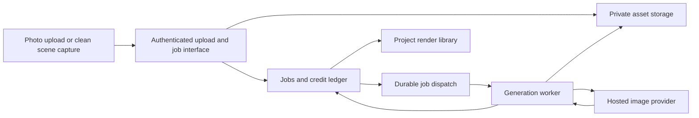

# HomeSpace.ai: AI interior visualization proposal

Date: 10 September 2026  
Status: Discussion draft; no implementation or provider selection approved.  
Skills used: research and codebase-design.  
Basis: Interior AI's public website and the current HomeSpace.ai working tree, including existing uncommitted changes.

## 1. Recommended direction

Add an **AI Visualize** workspace to HomeSpace.ai with two starting points: **upload a room photo** or **render the current 3D view**. Let users choose a room type and style, generate alternatives, compare them with the source, and save results to their project.

Start with these two workflows, then add empty-room staging and selected-area editing. HomeSpace's strongest opportunity is connecting visual inspiration to its existing spatial planning tools: users can explore an idea, inspect the original room dimensions, and deliberately translate suitable changes into an editable plan.

Keep three outputs clearly distinguished:

| Output | What it represents | Appropriate use |
| --- | --- | --- |
| Editable HomeSpace scene | Explicit rooms, furniture, openings, materials and coordinates | Planning, measurements, placement and model export |
| AI concept image | A generated interpretation of a photo or scene capture | Style exploration and presentation |
| Generated video or immersive world | A synthesized experience that may invent unseen details | Later-stage presentation, without dimensional guarantees |

An attractive AI image does not automatically become editable furniture, accurate geometry, or a construction-ready design. Source geometry should remain authoritative. A future “Apply to scene” action needs a separate structured proposal, validation and user review.

## 2. Reference feature inventory

The following summarizes public descriptions, not a hands-on test of paid functionality. The page advertises photo redesign, room/style presets, prompts, style-reference images, staging, sketch and SketchUp-screenshot rendering, outdoor design, selected-area editing, upscaling, wall/lighting/furniture changes, saved results, video, and immersive worlds. Its FAQ distinguishes structure-preserving and creative modes; neither constitutes an accuracy guarantee. [Interior AI](https://interiorai.com/)

| Reference capability | HomeSpace proposal | Priority |
| --- | --- | --- |
| Photo redesign | Upload → style → alternatives | MVP |
| Sketch/screenshot rendering | Capture our own 3D viewport first | MVP |
| Style and room presets | Small curated catalog | MVP |
| Saved designs | Project-linked render library | MVP |
| Empty-room staging | Dedicated furniture-only intent | Next |
| Local editing | Brush mask and instruction | Next |
| Style reference | Second image input | Next |
| Upscaling | Optional export operation | Next |
| Outdoor design | Separate evaluation set | Later |
| Video and immersive worlds | Separate presentation workflows | Later |

The public page also lists parallel generation and subscription tiers. Its timing, quality and commercial claims are vendor claims, not benchmarks for HomeSpace. Exact feature access should be checked before making a competitive comparison. [Interior AI](https://interiorai.com/)

## 3. What the product already provides

This assessment follows implementation files rather than assuming every README statement is current.

| Existing foundation | Evidence | Reuse and missing work |
| --- | --- | --- |
| React, TypeScript, Vite and Three.js | [package.json](../package.json) | Keep the frontend; introduce server execution for paid model calls |
| Landing, project library, pricing and studio views | [App.tsx](../src/App.tsx) | Add a visualization destination and studio entry action |
| Project metadata and scene data | [project.ts](../src/types/project.ts) | Add lightweight render associations and schema migration |
| Browser-local persistence | [indexedDBStorage.ts](../src/storage/indexedDBStorage.ts) | Preserve local work; add authenticated remote assets/jobs |
| Custom observable project store | [projectStore.ts](../src/state/projectStore.ts) | Follow its subscription pattern; do not assume Zustand is installed |
| Explicit room, furniture, door and window data | [scene.ts](../src/types/scene.ts) | Supply scene context and later geometric guidance |
| Three.js renderer and camera handling | [StudioCanvas.tsx](../src/canvas/StudioCanvas.tsx) | Introduce a deliberate clean capture interface |
| Screenshot tool | [viewTools.ts](../src/webmcp/tools/viewTools.ts) | Useful starting point, but currently returns metadata, not image bytes |
| Blueprint analysis pipeline | [geometryExtractor.ts](../src/geometry/geometryExtractor.ts) | Separate concern; not an interior image generation backend |
| Agent tool registration | [registry.ts](../src/webmcp/registry.ts) | Later expose the same generation interface to agents |

Important implementation findings:

- `take_screenshot` calls `canvas.toDataURL`, but returns only format, resolution label, byte-string length and timestamp. It selects the first canvas and does not implement the requested HD/4K dimensions. It can also change camera mode immediately before capture without awaiting a rendered frame. It is not yet a reliable image-input pipeline.
- The storage module uses native IndexedDB; the inspected stores use custom subscriptions. README mentions of `idb` and Zustand should not drive this implementation.
- No authenticated image-generation backend, durable generation queue, cloud asset store or billing enforcement was found in the inspected source and package configuration. These are new work, even though a pricing page exists.
- The current pricing page describes free preview access. Introducing paid AI usage needs clear separate messaging and enforced limits.
- Existing blueprint heuristics do not prove arbitrary room-photo reconstruction. Do not route photos into CAD extraction and imply accurate 3D conversion.

## 4. Proposed user experience

### A. Redesign a photographed room

1. Choose **Redesign a room** from the landing page or project library.
2. Upload a photo; preview orientation and crop. Explain unsupported files before upload finishes.
3. Select a room type and one of roughly eight curated styles. Suggested launch styles: warm contemporary, modern, minimalist, Scandinavian, Japandi, industrial, traditional and Indian contemporary. These are proposed product choices, not validated demand.
4. Add a short optional instruction, such as “Keep the floor and windows; use warm wood and cream fabrics.”
5. Show output count and credit cost before **Generate**. Start with one output by default; allow a small batch after cost measurement.
6. Show honest states: uploading, queued, generating, saving, ready or failed. Do not invent percentage completion.
7. Compare source and result with a slider and side-by-side option; favorite, download, retry or save to a project.

A photo can belong to a project without an associated modeled room. Do not require users to draw a floor plan before trying this workflow.

### B. Visualize the current 3D room

1. In the studio, choose a room and position the camera at a useful interior viewpoint.
2. Select **AI Visualize** and preview a clean frame with grid, selection outlines, labels and manipulation handles removed.
3. Select a style and optional instruction, then generate.
4. Save the image with the exact scene revision and camera used. If the scene changes, mark that the render belongs to an earlier revision.
5. Let users reopen the corresponding source snapshot or camera view; do not silently replace current work.

This is the recommended first technical prototype: our controlled scene captures make it easier to inspect whether the model moves doors, changes wall proportions or invents furniture.

### C. Empty-room staging

Give staging a distinct intent: furnish the room while retaining the envelope, openings and camera. Use empty rooms in its own evaluation set. Do not expose staging as dependable until it meets the structural acceptance threshold below.

### D. Selected-area editing

Let users brush a region and describe one change: replace a sofa, change a rug or repair an artifact. Store the parent result and mask so the edit history remains understandable. Translate mask coordinates against the original image, including crop and resize transforms. Model mask behavior varies; if strict preservation is required, composite the edited region over the original and evaluate edge seams.

## 5. Technical architecture

Keep the existing app and add a small server application with a durable worker. A practical default is TypeScript server code, PostgreSQL for jobs/ownership/usage, private object storage for images, and a durable queue. Choose hosted infrastructure after reviewing the project's deployment environment; no migration of the whole frontend is needed.

### Modules and their interfaces

Use a few deep modules: each exposes a small interface and hides meaningful implementation complexity.

| Module | Small interface | Hidden implementation |
| --- | --- | --- |
| Scene capture | `captureView(options) → CaptureArtifact` | Clean render, requested size, frame readiness, camera metadata, state restoration |
| Asset library | `createUpload`, `readAsset`, `deleteAsset` | Ownership, validation, object keys, signed access and deletion |
| Generation | `submit`, `get`, `listForProject`, `cancel` | Cost reservation, queueing, provider submission, recovery, result persistence |
| Usage | `reserve`, `settle`, `release` | Atomic ledger changes, limits and duplicate protection |

Place the provider seam inside Generation. During evaluation a real provider adapter and deterministic fake adapter have clear value; add a second production adapter only if there is a measured need. Do not scatter provider-specific prompts and statuses through React components.

### Job lifecycle and failure behavior

`queued → running → persisting → succeeded`, with `failed` and `cancelled` as terminal alternatives. A provider timeout with unknown outcome stays under reconciliation rather than immediately being resubmitted.

1. Authenticate and validate asset ownership, requested mode and allowed output count.
2. In a database transaction, enforce an idempotency key and reserve credits. Persist the job and durable dispatch intent together, for example with an outbox.
3. A worker claims the job with a lease and submits once; store the provider request identifier as soon as available.
4. Use supported callbacks or server-side status polling. Verify callback authenticity where supported and deduplicate delivery.
5. Copy successful outputs into our private storage before marking the job complete; provider URLs may expire.
6. Atomically settle actual delivered outputs and release unused reservations. Handle partial batches explicitly.
7. A reconciliation process handles stale leases, missed callbacks and jobs whose result was saved before a worker crashed.

Retry transient transport failures with bounded backoff only when duplicate provider work can be excluded. Do not retry moderation rejection or unsupported files. A cancelled browser request does not prove cancellation of paid provider work; describe cancellation as best-effort after submission and define whether the product absorbs that cost.

The browser can poll our job interface with backoff in the MVP. Refreshing or closing a tab must not lose a submitted job. A provider outage should leave ordinary local 3D editing available.

## 6. Data model and local-project integration

Suggested server records:

| Record | Key fields |
| --- | --- |
| ProjectLink | ownerId, remoteProjectId, localProjectId, displayName |
| Asset | id, ownerId, projectId, objectKey, mediaType, dimensions, checksum, kind, deletedAt |
| SceneSnapshot | id, ownerId, projectId, schemaVersion, sceneHash, sceneData or private asset reference |
| RenderJob | id, ownerId, projectId, mode, inputAssetIds, snapshotId, roomId, camera, styleId, styleVersion, prompt, modelVersion, status, providerRequestId, idempotencyKey, timestamps, errorCode |
| RenderResult | id, jobId, assetId, parentResultId, maskAssetId, favorite, qualityFeedback |
| CreditEntry | id, ownerId, jobId, type, amount, uniqueOperationKey, timestamp |

Do not treat a browser-generated project ID as proof of ownership. On first AI use, create an authenticated remote project link; photo-only projects may have no scene snapshot. Keep local editing and its existing persistence intact. Store full-resolution images outside the scene JSON, and cache only lightweight result metadata or thumbnails locally.

If the user wants only a picture, uploading the entire scene is unnecessary. For scene-based rendering, upload the source image and minimum context; save a full remote scene snapshot only when the chosen “reopen source” experience requires it and the user has opted into cloud project storage. A local snapshot can support same-browser reopening.

Project deletion must handle related jobs and assets. Mark deletion first, reject new work, and ensure late provider callbacks cannot recreate deleted results. Duplication should explicitly copy asset associations under the same owner or start a new result library; it should not accidentally transfer ownership. Existing projects need a backward-compatible migration, not a forced reset.

## 7. Model strategy and structure preservation

Use a hosted image-editing model for the initial proof of concept. Compare two candidates on our own room samples, then integrate one for the MVP. The companion [provider research](interior-ai-provider-research.md) records verified capabilities and primary documentation; model availability and prices must be rechecked at implementation time.

The evaluation should test instruction following, window/door retention, furniture plausibility, material realism, latency and cost per usable image. A model's general image quality is insufficient evidence for room design reliability.

For the first prototype, supply a clean source image with a constrained instruction. Example proposed template:

> Produce a realistic interior visualization of this room in the selected style. Preserve the camera viewpoint, room envelope and visible door and window positions. Follow the requested material changes. Do not add openings or text.

Version templates and styles so failures can be traced to a specific configuration. Keep user instructions separate from server-owned constraints. Prompts improve intent adherence; they are not geometric locks.

If structure drifts, investigate a pipeline with edge/depth guidance and masks. The 3D scene can supply aligned depth, normal and object-ID passes, but these help only if the selected model interface actually supports them. A generic additional reference image is not equivalent to a dedicated geometric control input. Photo-derived depth is estimated and usually lacks reliable absolute scale.

For strict staging, protect architectural regions through masks and consider compositing. For dimensionally faithful presentation, a conventional renderer of the existing scene may remain more suitable than generative editing. Avoid exposing a “preserve geometry” slider as a hard guarantee; use wording such as “Keep layout closer” only after testing its actual effect.

## 8. Capture implementation details

Replace incidental DOM canvas lookup with an explicit interface owned by `StudioCanvas`:

- Receive target width/height, camera and visibility options; return a Blob and capture metadata.
- Render at the requested aspect ratio and size, not merely a changed label.
- Hide helpers and selection effects for capture; restore all state in a `finally` path.
- Wait for scene assets and the next completed render, including the asynchronous renderer path.
- Prefer an offscreen render target if practical so capture does not visibly resize the editor.
- Return clear errors for missing renderer, failed encoding, unsupported size or blocked texture readback.
- Record source scene hash, camera projection, position, target, output size and color configuration.

Depth/mask passes can be added later using the same camera and dimensions. They should be captured from the same immutable scene snapshot to avoid misalignment if a user edits during generation.

## 9. Security, privacy and operating cost

Private home photographs need private asset access. Keep model credentials server-side; never use frontend `VITE_*` variables for secrets. Authenticate all job and asset operations, enforce ownership, use short-lived upload/download permissions, validate file signatures and decoded pixel limits, normalize orientation and strip unnecessary EXIF metadata. Start with JPEG, PNG and WebP; add HEIC conversion only when supported and tested.

Do not accept arbitrary remote URLs in the initial upload interface. Use bounded upload sizes, per-user concurrency limits and spend caps. Avoid raw photos, signed URLs and complete user prompts in routine logs. Decide retention and deletion behavior before launch, including provider-side retention; do not promise zero retention or no training without confirming the provider arrangement.

Measure economics as:

`cost per usable result = total provider + storage + delivery + worker costs / user-accepted results`

Illustration only, not a provider quote: if each attempt costs $0.05 and 60% of results are usable, generation alone costs about $0.083 per usable result. Four attempts cost $0.20 before storage and other expenses. Higher resolution, repeats, editing and video can change this substantially.

Start with metered image credits and bounded output batches. Reserve credits when the server accepts a job; settle delivered outputs and release unused reservations. Failed provider work may still cost us money even when the user is not charged. Track both vendor cost and user credit settlement separately. Do not copy a competitor's high-volume allowances before measuring these figures.

## 10. Suggested delivery phases

These are planning ranges for one experienced full-stack developer, not commitments. Access setup, model quality and production requirements can lengthen them.

| Phase | Scope | Exit condition | Rough effort |
| --- | --- | --- | --- |
| 0: Quality spike | Curated captures/photos, two-provider comparison, manual evaluation | One candidate meets quality and cost targets, or a documented no-go | 3–5 working days |
| 1: Private MVP | Photo + scene inputs, styles, one provider, auth, assets, durable jobs, history, compare/download, internal quota | End-to-end generation survives refresh and failure | 2–3 weeks |
| 2: Production beta | Credit ledger hardening, spend limits, deletion, monitoring, payment integration if charging, device QA | Operational and ownership tests pass | 1–2 weeks |
| 3: Editing | Staging, masks, reference style and optional upscale, selected by demand | Each mode passes its own image evaluation | 2–3 weeks |
| 4: Spatial proposals | Translate selected concepts into validated scene changes | Dimensions/circulation remain valid and changes are undoable | Separate research estimate |
| 5: Presentation expansion | Video, generated worlds, sharing | Proven demand and sustainable cost | Separate research estimate |

For a demo, we can omit public subscriptions and use an authenticated internal quota. For a public paid launch, identity, ownership and spend enforcement are prerequisites rather than polish.

Potential implementation locations: `src/features/visualize/` for the workflow, `src/rendering/` for capture, `src/types/render.ts` for shared result types, and a new `server/` area for job/asset/provider implementation. These are proposed locations; do not move existing modules just to match this outline.

## 11. Validation and launch gates

Build a rights-cleared set of 30–50 cases covering small bedrooms, living rooms, kitchens, empty rooms, clutter, low light, mirrors, unusual openings and HomeSpace scene captures. Keep a holdout subset out of prompt tuning. Evaluate each mode separately with repeat generations.

Proposed quality gate: at least 80% of cases receive a usable concept within two attempts, and fewer than 5% of conservative/staging results show major changes to visible architecture. These are proposed targets, not observed performance. Define a major change as a moved/added opening, altered room envelope or materially changed camera perspective. Have two reviewers score a sample and resolve disagreement. If staging fails, ship concept visualization without claiming reliable staging.

Track time to first result, p50/p95 completion time, technical success, structural defect rate, regeneration rate, save/download rate and cost per accepted result. Establish latency expectations from measurements rather than promising instant output.

Engineering acceptance checks:

- Capture returns the requested dimensions, excludes helpers and restores the editor.
- Double submission with the same key creates one logical job and one reservation.
- Worker restart and duplicate callbacks do not double-charge or duplicate results.
- Ambiguous provider timeout is reconciled without blindly generating again.
- A partial batch has correct result count and credit settlement.
- User A cannot access user B's assets, jobs or project links.
- Refresh restores pending and completed jobs; expired provider URLs do not break saved results.
- Local projects still open after schema migration; new AI activity does not mutate scene geometry.
- Delete during generation cannot resurrect assets through a late callback.
- Comparison works on mobile and with keyboard controls; status changes are announced accessibly.

Use a fake provider for deterministic workflow tests and a small explicit paid smoke test for the production integration. Image quality needs human evaluation; pixel-equality tests are not an adequate substitute.

## 12. Decisions for our discussion

| Question | Suggested starting answer | Why it matters |
| --- | --- | --- |
| Who is the first customer? | Existing HomeSpace users planning a room | Keeps the new feature connected to the core product |
| Which experience leads? | Photo redesign plus current-scene rendering | Easy entry plus a differentiated studio workflow |
| What should the first release promise? | Useful visual concepts | Prevents confusion about geometric precision |
| How many styles? | Around eight, curated and tested | Better evaluation coverage than a large untested catalog |
| Should generated images alter the model? | Only through a later reviewed proposal | Preserves explicit scene data and undo history |
| How should we charge? | Measure first, then bounded credits | Avoids committing to unsustainable allowances |
| Should video launch immediately? | Defer until image workflows work well | Requires separate quality, persistence and cost handling |

My recommended next step after discussion is a small quality spike using our own 3D room captures and a few real-room photos. Decide the provider and public feature promises from those results before building the full billing and generation system.

## Sources and limits

- [Interior AI public website and FAQ](https://interiorai.com/), accessed 10 September 2026. Public feature claims only; no paid workflow, quality or speed independently tested.
- Local implementation files linked in Section 3, inspected on the same date. Source review only; existing tests were not rerun for this document-only task.
- [Provider research and first-party documentation](interior-ai-provider-research.md), companion research note. Proposed architecture and product choices above are our recommendations, not claims about Interior AI's private implementation.

No application source changes, package installation, paid generation, commits or deployment are part of this proposal.
